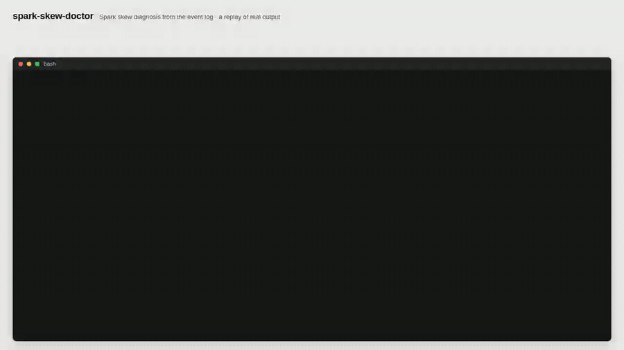
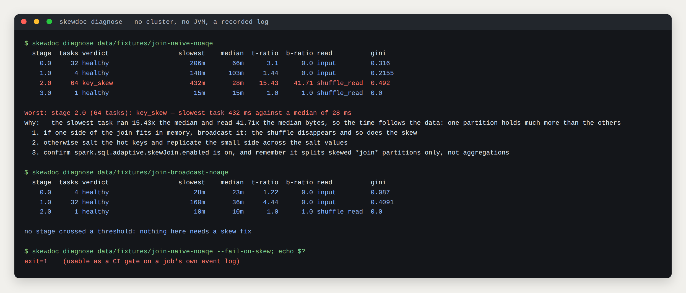
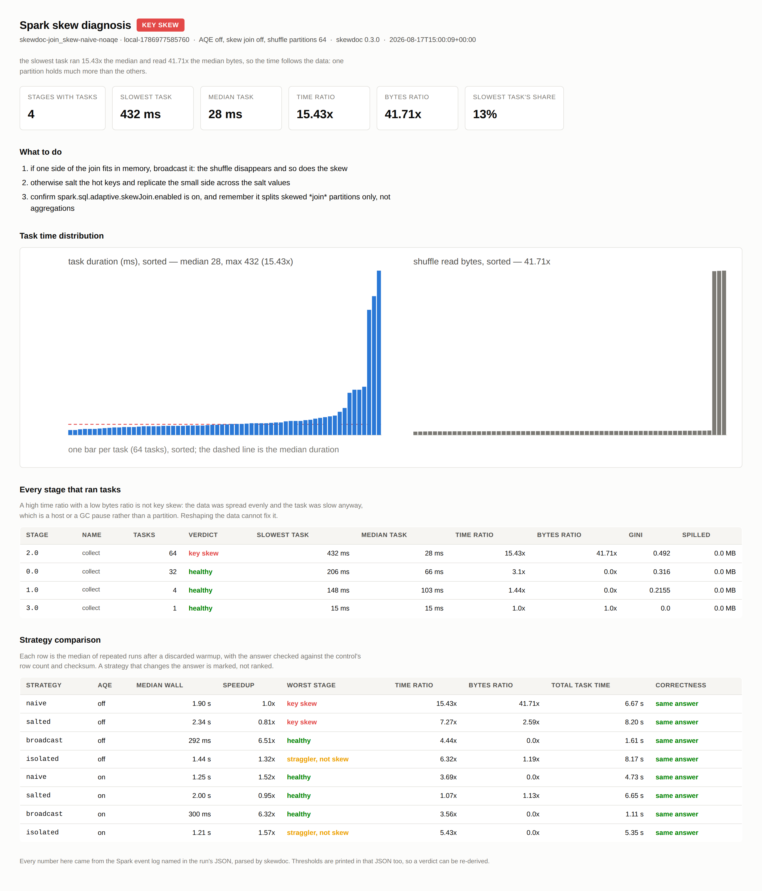
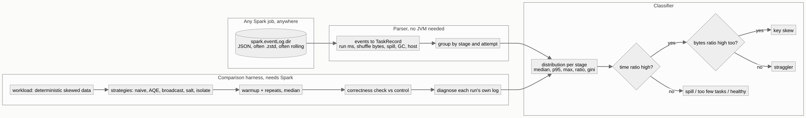
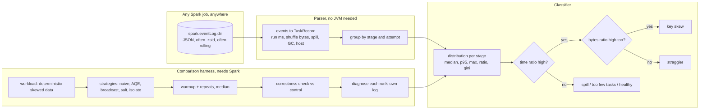

# spark-skew-doctor

**Reads a Spark job's own event log, says whether a stage is skewed and — the part that matters — whether it is *key* skew or something a skew fix cannot touch. Then it runs the fixes against each other and reports which one actually won, which on this workload was not the one everybody writes.**

[](https://github.com/sivananda1995/spark-skew-doctor/actions/workflows/ci.yml)
[](#tests-coverage-and-receipts)
[](#tests-coverage-and-receipts)
[](#every-number-here-is-checked-by-ci)
[](#what-actually-won)
[](LICENSE)

## What this solves

- **"The stage is skewed" is the wrong diagnosis about half the time.** A slow task can be key skew, a straggler on a busy host, a spill, or a stage with too few tasks to spread — four different fixes. The discriminator is whether the slow task also read more *data*, and this tool computes it: the demo's naive join is diagnosed as key skew because its slowest task ran 15.43x the median and read 41.71x the median bytes, while its adaptive-execution twin is a straggler with an even byte distribution.
- **Diagnosis needs no cluster, no JVM, and no rerun.** It reads the JSON event log Spark already wrote — the same file the History Server renders — so last night's four-hour job can be diagnosed this morning from a copied directory. `pip install`, one command, no Spark.
- **The canonical fix lost.** Across [16 strategy cells](#what-actually-won) — four join strategies and two aggregation shapes, each with adaptive execution off and on, every cell timed as the median of repeated runs and checked for correctness — salting won 0 of them. broadcast is 6.51x, adaptive execution alone is 1.52x, and salting is 0.81x: *slower than doing nothing*.

## Executive summary

A skewed Spark stage has one task doing most of the work. The standard advice is to salt the hot key, and the standard advice is usually wrong now, because adaptive query execution splits skewed join partitions by itself and a missing broadcast is a bigger problem than an unbalanced one. None of that is arguable from first principles; it needs measuring on a real Spark job with real task metrics.

So this repository has two halves.

**A diagnoser.** `skewdoc diagnose <event-log>` parses Spark's event log into per-task metrics — `Executor Run Time`, shuffle read bytes and records, spill, GC, fetch wait, executor id — and classifies every stage. The classification exists because the *shape* of the imbalance says what to do:

| verdict | what it means | what the tool measures | what fixes it |
| --- | --- | --- | --- |
| **key skew** | one partition holds far more data | time ratio high **and** bytes ratio high | broadcast, adaptive skew join, salting |
| **straggler** | data is even, one task was slow anyway | time ratio high, bytes ratio ≈ 1 | speculation, the host; *not* reshaping data |
| **spill** | partitions do not fit execution memory | spill bytes with no large imbalance | more partitions or more memory |
| **too few tasks** | the stage is serial, not skewed | fewer tasks than the noise floor allows | more partitions upstream |

**A comparison harness.** `skewdoc compare` runs the same query under every strategy, times each as the median of repeated runs after a discarded warmup, checks that every strategy returned the same answer as the control, and diagnoses each run from its own log. The join workload is 2 million rows over 20,000 keys with 72% of the rows on three of them; the naive join takes 1899 ms, and with one task per 64 shuffle partitions the slowest of them carries 13% of the stage's task time.

Every number in this document is re-measured by `make verify`, and the build fails if any of them has moved.

## Watch it work (60 seconds)



Every line of terminal output is the real stdout of the command shown with it, captured by `tools/record_demo.py` and paced by that command's measured wall time. `docs/video/manifest.json` lists each command with its exit code and duration. Higher quality MP4: [`docs/video/skew-demo.mp4`](docs/video/skew-demo.mp4).

## Diagnosing a job you did not run

```bash
skewdoc diagnose data/fixtures/join-naive-noaqe
```



The event logs under `data/fixtures/` are Spark's own output from the runs in this README, committed so the diagnosis is reproducible without a JVM. Point the same command at `spark.eventLog.dir` on any cluster and it works the same way: rolling directories, `.zstd` and `.lz4` compression, and stage retries are all handled, and a stage's retry is analysed separately from its first attempt because mixing them invents skew that never happened.

The HTML report draws the per-task distribution — one bar per task, from the log, nothing reconstructed from quantiles — with time on the left and bytes on the right, which is the picture that makes the key-skew-versus-straggler distinction obvious at a glance:



## What actually won

```bash
skewdoc compare --workload join_skew --out docs/experiments/join_matrix.json
```

Join workload, 2M rows, three hot keys holding 72% of them, 64 shuffle partitions, `local[4]`, Spark 4.0.4. Each cell is the median of three runs after a discarded warmup, and every cell returned the control's row count and checksum:

| strategy | AQE off | verdict | AQE on | verdict |
| --- | --- | --- | --- | --- |
| naive | 1899 ms (1.00x) | key skew, 15.4x | 1247 ms (1.52x) | healthy |
| **broadcast** | **292 ms (6.51x)** | healthy | 300 ms (6.32x) | healthy |
| isolate hot keys | 1441 ms (1.32x) | straggler | 1208 ms (1.57x) | straggler |
| salted (16) | 2336 ms (0.81x) | key skew, 7.3x | 1999 ms (0.95x) | healthy |

Read the bottom row again. Salting *balanced* the partitions — the time ratio fell from 15.4x to 7.3x, and to 1.07x with adaptive execution on — and the query still got **slower**, because balancing cost more than the imbalance did. The dimension table is replicated 16 times, so the shuffle moves more data to move it more evenly.

Broadcast is the fix — broadcast is 6.51x — and it is not really a skew fix at all: it deletes the shuffle instead of balancing it. The committed broadcast run is healthy at every stage. Meanwhile isolating the hot keys is 1.32x, which buys a second pass over the fact table for a third of what a broadcast gives away for free. Most "skew problems" in the wild are a missing broadcast.

### The same comparison for aggregations

Two aggregation shapes, because they fail differently:

| workload | naive, AQE off | salted, AQE off | naive, AQE on |
| --- | --- | --- | --- |
| `sum`, `count`, `max` | 1458 ms — and the composable aggregation is healthy | 3761 ms | 639 ms (2.28x) |
| `collect_list` | 2558 ms, key skew 11.2x | 3001 ms | 1143 ms |

For the composable aggregation, salting a composable aggregation is 0.39x — two and a half times slower — and the naive plan is not even diagnosed as skewed. The reason is worth knowing: **Spark already aggregates partially before the shuffle**, so a `sum`/`count`/`max` group-by is *already* a two-stage aggregation, the hot group's rows are folded down map-side, and the shuffle carries one partial row per key per partition. Salting adds a stage to do what the planner did for free.

I expected `collect_list` to be where salting finally wins, since a collected list cannot be folded down and the hot group's rows genuinely all have to arrive together. It is diagnosed as key skew, 11.2x — and salting it is 0.85x, still a loss, because the second stage has to reassemble the hot key's whole array in one task anyway. Meanwhile adaptive execution gives 2.24x for free.

### Does salting ever win?

```bash
python benchmark/bench_severity.py
```

Not on this workload at any severity. The sweep holds everything constant and varies how much of the fact table lands on the hot key across 4 severities:

| hot-key share | naive (AQE off) | AQE speedup | salting speedup | winner |
| --- | --- | --- | --- | --- |
| 20% | 2400 ms, key skew | 1.47x | 1.04x | AQE |
| 50% | 1594 ms, key skew | 1.87x | 1.04x | AQE |
| 80% | 1119 ms, key skew | 1.30x | 0.77x | AQE |
| 95% | 1052 ms, key skew | 1.08x | 0.87x | AQE |

**What this does and does not license.** It says: on a 4-core local Spark 4.0.4 with a dimension table that fits in memory, reach for a broadcast, then for adaptive execution, and treat salting as the thing you try when both are unavailable. It does not say salting is useless — it is still the answer when the build side is too large to broadcast, when adaptive execution is off (Spark 2.x, or disabled to stabilise plans), or when the skew is in a `groupBy` whose aggregate cannot be folded and whose *output* per key is small. What it does say is that "we have skew, add salt" should be a measurement rather than a reflex, and that the measurement takes one command.

## Architecture



<details>
<summary>the diagram source, and why this is an image</summary>

GitHub renders `mermaid` fences itself, and when it works the source is the picture. It does not always work: this diagram parses and renders with mermaid 10 and 11 locally, and GitHub showed `Unable to render rich display: Cannot read properties of undefined (reading 'render')`, which is a failure inside their renderer rather than a syntax error here. So the picture is generated once by `tools/render_diagrams.py`, committed, and embedded, which renders identically on GitHub, in an editor preview, in a PDF and offline. The source below is in a plain fence so nothing tries to render it, and regenerating the image after editing it is one command.



</details>

## Quickstart

Prerequisites: Python 3.10+. Diagnosis needs nothing else. The comparison harness needs the `spark` extra and a JVM (Java 17 or 21).

```bash
git clone https://github.com/sivananda1995/spark-skew-doctor.git
cd spark-skew-doctor
python -m venv .venv && source .venv/bin/activate    # Windows: .venv\Scripts\activate
pip install -e ".[dev]"                              # diagnosis only, no JVM
pip install -e ".[dev,spark]"                        # add the harness

skewdoc diagnose data/fixtures/join-naive-noaqe      # the committed skewed run
skewdoc diagnose <your-event-log> --html report.html --fail-on-skew
skewdoc compare --workload join_skew                 # needs Spark
make verify                                          # lint, 69 tests, and every number re-measured
```

`skewdoc diagnose --fail-on-skew` exits 1 when a stage is skewed, which makes it usable as a CI gate on a job's own log. `make help` lists every target.

## Tech stack

| Technology | Role here | Why chosen |
| --- | --- | --- |
| Spark 4.0.4 event log (JSON) | The only source of truth about tasks | It is what the History Server reads, it survives the cluster, and parsing it needs no connection to anything. A `SparkListener` would need a py4j callback server and would only see jobs it was attached to |
| PySpark, `local[4]` | Running the comparison harness | A reviewer can reproduce the whole matrix on a laptop. What local mode faithfully reproduces is the *shape* of skew, because the hash partitioner decides it, not the machine count (ADR-001) |
| Deterministic data generation | The workloads | Hot/tail assignment from a hash of the row id, not an RNG, so partitions are byte-identical between runs and a before/after is a comparison rather than a coincidence |
| `zstandard`, optional `lz4` | Reading compressed logs | Spark 4 compresses event logs by default; the reader dispatches on extension and names the missing package instead of failing with a Unicode error |
| Hand-written inline SVG | The per-task chart | The report stays one self-contained file, and the diagnosis path keeps zero plotting dependencies |
| pytest with a `spark` marker | 69 tests and 92% line coverage | The suite runs on a machine with no JVM; the marked tests prove the format written is the format read |
| ruff | Lint and import order | One fast tool on every commit |
| Playwright with Chromium, ffmpeg | Screenshots and the demo video | Every image is rendered from real output, so the documentation cannot drift from the behaviour |

## Performance and honesty about measurement

The measurement protocol is the part of this repository I would most want reviewed, because the first version of it produced a wrong answer.

Every cell is: one warmup run whose time is **discarded**, then the median of repeated runs, all in one session; then one more run in a fresh session so the event log being diagnosed contains exactly one execution of the query. The reason is that a JVM is not a stopwatch. The same query, unchanged, took 6,457 ms, then 3,483 ms, then 2,846 ms on three consecutive runs in one process — the JIT compiles the generated code and the page cache fills. Across the committed matrices the warmup run is up to 3.4x slower than the median of the runs after it.

A matrix that measures each cell once therefore ranks its cells partly by *when they ran*. Mine did, and it reported salting as 1.7x faster than the naive plan, because the naive plan had the misfortune of running first. With the warmup discarded, salting is 0.81x. The bug was in the harness, not in Spark, and it was invisible until the protocol changed.

Two more properties matter for trust:

- **Every strategy is checked for correctness, not just speed.** Salting adds a column, isolation unions two frames, a two-stage aggregation rewrites the plan: each is a chance to return a subtly different number faster. Every run reports its row count and a checksum, and a strategy that disagrees with the control is reported as **wrong**, never ranked as fast. All 16 cells agreed.
- **Local mode is not a cluster and the README says so.** The absolute milliseconds here are a laptop's. What transfers is the ordering of the strategies and the shape of the distributions, because both are decided by the partitioner and the data. [ADR-001](docs/adr/ADR-001-local-mode-and-what-it-proves.md) is explicit about which conclusions survive the move to a real cluster and which do not.

## Tests, coverage, and receipts

69 tests and 92% line coverage, measured with `pytest --cov=skewdoc` — the 90% pytest prints in the terminal is the blend of line and branch coverage, and both are in `docs/metrics.json` so a reader comparing them finds the difference explained rather than wondering about it. Two tests are marked `spark` and run real Spark jobs; the rest need no JVM, so CI runs the whole diagnosis path on three Python versions without one and the Spark job separately.

The parser is tested against **real committed event logs** rather than hand-written JSON, because a synthetic fixture encodes what I believed the format was, and the interesting bugs live in what I believed wrongly. The hand-built logs that do exist cover the failure paths a real log will not produce on demand: a truncated final line, an unknown codec, a stage retry, `events_10` sorting before `events_2`.

### Every number here is checked by CI

```bash
make receipts     # python tools/collect_metrics.py && python tools/check_numbers.py
```

`tools/collect_metrics.py` re-parses and re-diagnoses the committed event logs, reads the comparison JSON, runs the suite, and writes every value to `docs/metrics.json` with the command that produced it. `tools/check_numbers.py` then asserts that each value still appears **inside the sentence that claims it** — a metric registers an anchor phrase such as `"ran {}x the median"` — because searching a long document for `64` proves nothing. The design came from the [rag-regression-gate](https://github.com/sivananda1995/Rag-regression-gate) project, where the first version of the same check reported "every number matches" while three were wrong.

## Architecture Decision Records

- [ADR-001: local mode, and exactly what a local measurement proves](docs/adr/ADR-001-local-mode-and-what-it-proves.md). Which conclusions survive the move to a cluster, and which are laptop artifacts.
- [ADR-002: the classification thresholds, where they come from, and the two false positives they had](docs/adr/ADR-002-classification-thresholds.md). Including the dominance rule that flagged every adaptive-execution stage until it learned to scale with task count.
- [ADR-003: the measurement protocol](docs/adr/ADR-003-measurement-protocol.md). Warmup, repeats, medians, and the correctness check — written after the protocol's absence produced a wrong headline.

## Intentionally out of scope

- **Fixing the job automatically.** The tool diagnoses and recommends; it does not rewrite anybody's query. A rule engine confident enough to edit a plan would need to be right far more often than this one is, and the recommendations are ordered by expected value precisely so a human picks.
- **A `SparkListener` for live jobs.** Streaming the diagnosis while a job runs is useful and needs a py4j callback server plus a JVM shim. The event log is what exists after the fact, which is when the question gets asked.
- **Cluster-scale numbers.** Everything here is `local[4]`. The strategy *ordering* is the transferable result; the milliseconds are not (ADR-001).
- **Skew in writes.** Partition skew on output — one enormous file per partition — is a related problem with different fixes (`repartition` before write, `maxRecordsPerFile`), and it is not measured here.
- **Multi-column and composite keys.** Mechanical to add to the salting and isolation strategies, and it would not change a single conclusion.

## Security and compliance

- **No credentials anywhere.** The tool reads a file and, optionally, starts a local Spark session. There is nothing to authenticate to.
- **Hot keys are data.** Task metrics are aggregates, but a diagnosis that names the hot keys is naming business values. They appear in reports, which are artifacts under the same access control as the job, and never in logs; `tests/test_logging_and_extra_cli.py` asserts the formatter degrades an unserialisable extra rather than reaching for `repr()`.
- **Event logs can contain more than metrics.** A real event log includes the full SQL description and every Spark property, which can carry table names, paths, and occasionally credentials in a JDBC URL. The parser reads what it needs and the report prints only stage-level aggregates and the configuration keys it names explicitly.
- **Least privilege in CI.** `permissions: contents: read`. The tool writes only inside its workspace and communicates through exit codes.
- **Supply chain.** Two runtime dependencies: PyYAML and `zstandard`. PySpark is an optional extra, so a consumer that only diagnoses logs does not install 300 MB of Spark.

## Failure modes

| Failure | Detection | Behaviour | Recovery |
| --- | --- | --- | --- |
| Event log is compressed with an unavailable codec | Extension dispatch at open time | Exit 3 naming the codec and the package that reads it | `pip install zstandard` or `lz4`, or re-run the job with a different `spark.eventLog.compression.codec` |
| Event log is still being written | Final line fails to parse | Exit 3 saying the application may still be running | Wait, or copy the completed parts |
| Rolling log directory | `events_N` parts detected | Read in numeric order, not lexicographic | None needed |
| A stage was retried | `(stage id, attempt)` keys everything | Attempts analysed separately, newest first | None needed |
| A stage ran three tasks | Task count below the noise floor | Reported as too few tasks, not as skew | Raise `spark.sql.shuffle.partitions` |
| A 5 ms stage with a 10x ratio | Stage task time below the floor | Reported healthy: 4 ms of noise is not a finding | None needed |
| A strategy returns a different answer | Row count and checksum against the control | Reported as **wrong** and excluded from any ranking | Fix the strategy; the harness will not rank it |
| PySpark or a JVM missing | Checked before a session is built | Exit 4 naming what to install, and diagnosis still works | `pip install -e ".[spark]"`, install Java 17 or 21 |

## Hardest problem solved

### The benchmark that ranked its cells by when they ran

The first join matrix said salting was 1.7x faster than the naive plan. It is 0.81x. The difference was entirely measurement: each cell ran once, the naive plan ran first, and the first Spark query in a process pays for JIT compilation and a cold page cache. Three consecutive identical runs went 6,457 ms, 3,483 ms, 2,846 ms.

What makes this worth writing down is that the wrong number was *plausible* — salting is supposed to help, so a 1.7x improvement looked like a confirmation and nothing about it invited a second look. The only reason it came apart was running the same cell three times to see how noisy the measurement was, which is a thing worth doing before believing any benchmark, including one's own.

The fix is in [ADR-003](docs/adr/ADR-003-measurement-protocol.md): a discarded warmup, the median of repeats, and a separate single-run session for the log being diagnosed, so a run's diagnosis is not an average of four executions. Every number in this README comes from that protocol, and the warmup times are published beside the medians so a reader can see the effect rather than take my word for it.

### The rule that called every adaptive-execution stage skewed

The classifier has a dominance rule: if one task holds 30% or more of a stage's total task time, that alone counts as skew, however the ratios look. It fired on almost every stage of every adaptive-execution run, and the reason is arithmetic. Adaptive execution coalesces small shuffle partitions, so a stage that had 64 tasks now has 5 — and in a 5-task stage one task holds 20% *by construction*. The threshold was measuring the task count, not the distribution.

The fix is to scale it: the threshold is now the larger of 30% and four times a balanced task's share, so a 64-task stage still trips at 30% while a 5-task stage needs 80%. The overcorrection is instructive too — my first attempt made the threshold purely relative, which stopped the rule firing at all, and re-running the classifier against the committed logs reported the naive join as healthy despite its 15.43x ratio. Only the combination is right, and only re-diagnosing the stored logs after each change made either mistake visible.

Both false positive and false negative are in [ADR-002](docs/adr/ADR-002-classification-thresholds.md), with the thresholds the shipped version uses and where each came from.

### The fix I was sure would win, twice

I built the aggregation workloads expecting to demonstrate that salting is necessary for group-by skew, because adaptive execution's skew handling applies to joins and a hot group's rows have to meet somewhere. The first result was that salting a `sum`/`count`/`max` group-by is 0.39x — two and a half times *slower* — and that the naive plan is not diagnosed as skewed at all, because Spark's map-side partial aggregation had already folded the hot group down before the shuffle. A composable aggregation is already two-stage; salting adds a stage to redo the planner's work.

So I built a second workload with `collect_list`, where partial aggregation cannot fold anything and the theory says salting must help. That one *is* diagnosed as key skew, 11.2x, and salting it is 0.85x: still a loss, because the combining stage has to assemble the hot key's entire array in one task regardless of how many pieces it arrives in.

Two wrong predictions in a row, both measured, both published. The generalisable lesson is the one in the badge: across 16 cells salting won 0 of them, and the reason is not that salting is a bad technique but that the planner has been improving underneath the advice for six years. The reason to keep the salted implementations in the repository is that they are the control which makes that statement checkable.

## Future work

- **A real cluster run** of the same matrix, to separate what is local-mode arithmetic from what is Spark's behaviour. The harness needs a `--master` and nothing else; the numbers deserve a second table rather than a footnote.
- **`skewdoc diagnose --watch` against a History Server's API**, so a job that finished ten minutes ago can be diagnosed without copying a directory.
- **Write-side skew**, which shares the diagnosis machinery and has entirely different fixes.
- **A threshold calibration mode**: given a directory of logs from healthy runs, report what the thresholds *should* be for this cluster rather than shipping numbers derived from one laptop.
- **First metric to watch after adoption**: the share of diagnoses that come back `straggler`. A cluster where most slow stages are stragglers has an infrastructure problem, and no amount of query rewriting will touch it.
